环境搭建：Angular-cli

开发语言：TypeScript

一、在angular中配置好react所需的语法环境
使用react，需要引用react 和react-dom 以及他们的类型声明文件，还会用到JSX：

npm install --save react react-dom
npm install --save @types/react @types/react-dom
【使用JSX必须给相应的文件一个.tsx扩展名】：angular当前的配置是否解析tsx文件
【启用JSX选项】：怎么在typescript中使用JSX

如果不解析tsx文件的话，他会出现这种报错：

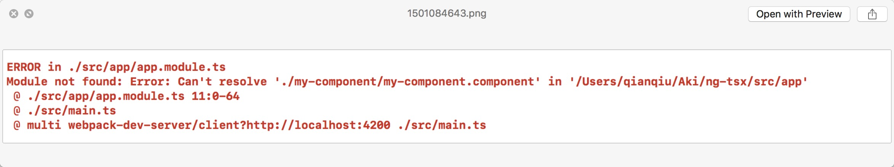

angular-cli默认没有把webpack配置暴露出来，可以使用ng eject命令 把当前webpack的配置导出 暴露在项目中方便修改。

于是加上了处理tsx的loader和后缀解析：

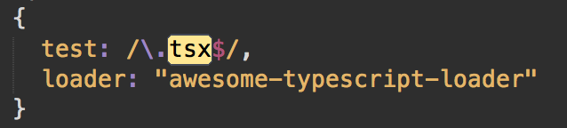

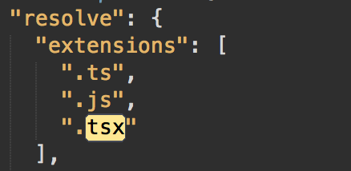

以及在tsconfig中添加jsx配置

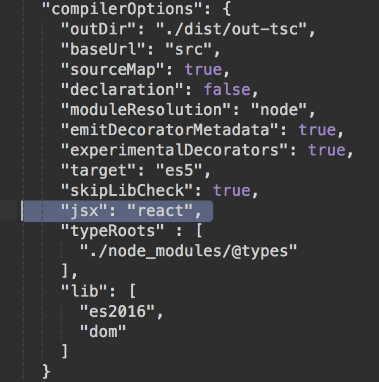

@types/react的编译报了一堆错，ts版本太高 @types/react版本太低 反正定义文件报错 并不影响使用

所以就又加一个配置项，让他别去检查第三方库的语法 #382

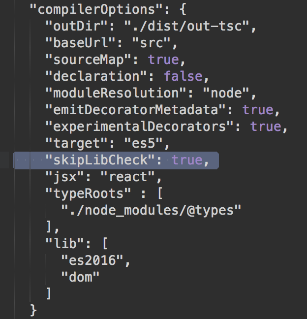

二、写一个简陋的用来“加载”react组件的angular组件
首先上完整代码：

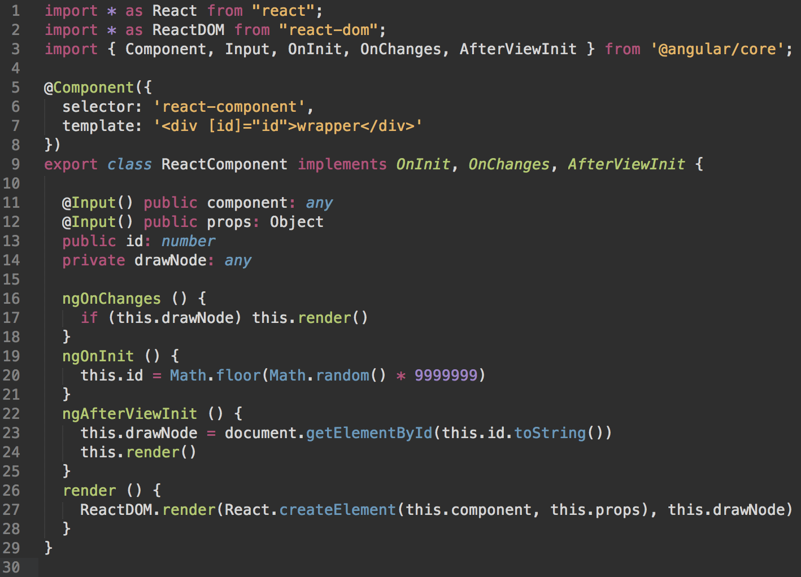

这里我们需要讲angular的生命周期：

无论是指令或组件，他们的实例有生命周期：新建creates、更新updates和销毁destroys。我们可以通过调用相应的生命周期钩子接口，来在这些时间点中做自己想要的操作。

比如此时我们想在OnInit, OnChanges, AfterViewInit状态介入，我们可以实施这几个接口。每个接口都有唯一的方法，方法的名字是接口名+ng前缀。比如，OnInit接口的钩子方法叫做ngOnInit

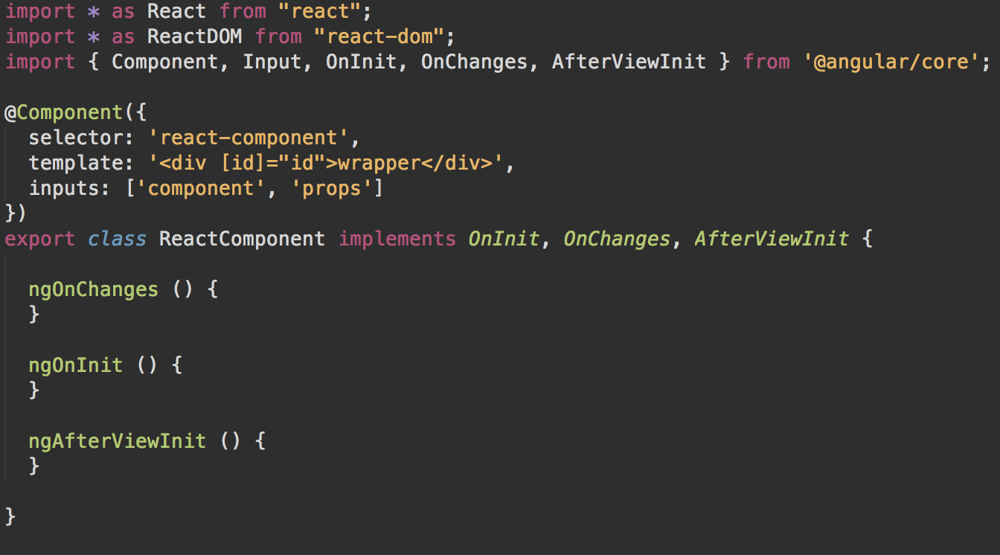

也可以不写implement OnInit, OnChanges ^&(()_*()&&^%7685*% 这一大串，写了的好处就是如果你没写 他会报错 叫你写上

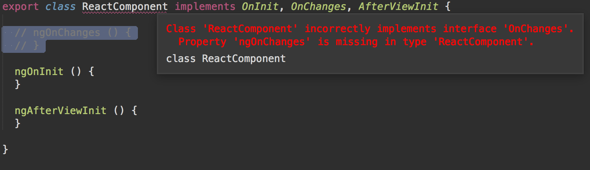

想要理解我们的代码做了什么，需要先理解一下生命周期中各个钩子干了什么事情。

当Angular使用构造函数新建一个组件或指令后，就会按一定的顺序在特定时刻调用这些生命周期钩子方法：

| 钩子  | 目的和时机  |
| :------------ | -----:|
| ngOnChanges()| 当Angular（重新）设置数据绑定输入属性时响应。首次调用一定会发生在ngOnInit()之前。 |
| ngOnInit()| 第一次显示数据绑定和设置指令/组件的输入属性之后，初始化指令/组件。在第一轮ngOnChanges()完成之后调用，只调用一次。|
| ngDoCheck() | 在每个Angular变更检测周期中调用，ngOnChanges()和ngOnInit()之后。 |
| ngAfterContentInit() | 只适用于组件。当把内容投影进组件之后调用。第一次ngDoCheck()之后调用，只调用一次。 |
| ngAfterContentChecked() | 只适用于组件。每次完成被投影组件内容的变更检测之后调用。ngAfterContentInit()和每次ngDoCheck()之后调用 |
| ngAfterViewInit() | 只适用于组件。初始化完组件视图及其子视图之后调用。第一次ngAfterContentChecked()之后调用，只调用一次。 |
| ngAfterViewChecked() | 只适用于组件。每次做完组件视图和子视图的变更检测之后调用。ngAfterViewInit()和每次ngAfterContentChecked()之后调用。 |
| ngOnDestroy() | 在这儿反订阅可观察对象和分离事件处理器，以防内存泄漏。当Angular每次销毁指令/组件之前调用并清扫。 |
于是我们讲一下我们用到的几个钩子。

首先OnChanges

当该组件(或指令)的输入属性@Input() xxxx发生了变化，Angular就会调用它的ngOnChanges()方法。

比如下图，初次创建这个组件，以及输入的status、productList变化时，都会触发ngOnChanges这个狗子

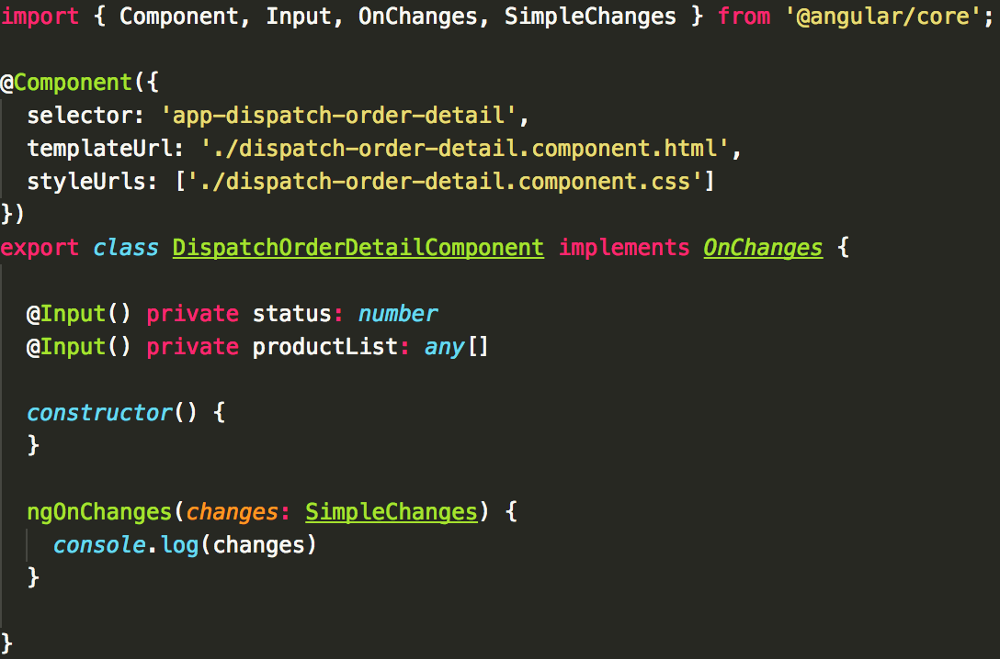

打印出来像这样子的：

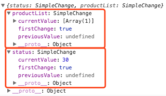

然后再看OnInit，

他的触发时机是：Angular设置完输入属性之后，开始建立这个组件。 

我们在构造函数中，除了使用简单的值对局部变量进行初始化之外，什么都不应该做。而ngOnInit()是组件获取初始数据的好地方。另外还要记住，在指令的构造函数完成之前，那些被绑定的输入属性还都没有值。

如果我们需要基于这些属性的值来初始化这个指令，这种情况就会出问题。 而当ngOnInit()执行的时候，这些属性都已经被正确的赋值过了。因为我们访问这些输入属性的第一次时机，是OnChanges的时候（发生在OnInit前）

然后是AfterView钩子，

这个钩子就是用来在父组件中 去监听/访问子组件的数据的，包括了AfterViewInit()和AfterViewChecked()。触发的时间是当子组件中 数据有变化的时候。

了解完了钩子之后，其实我们的代码就非常的容易理解了。

reactComponent接受一个两个输入属性：react组件和其相关属性props

<react-component
    [component]="embedComponent"
    [props]="embedComponentProps">
    </react-component>`

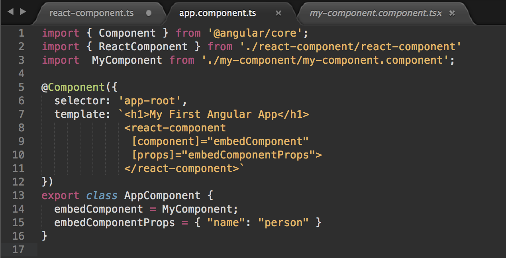

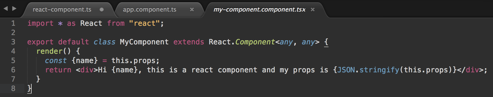

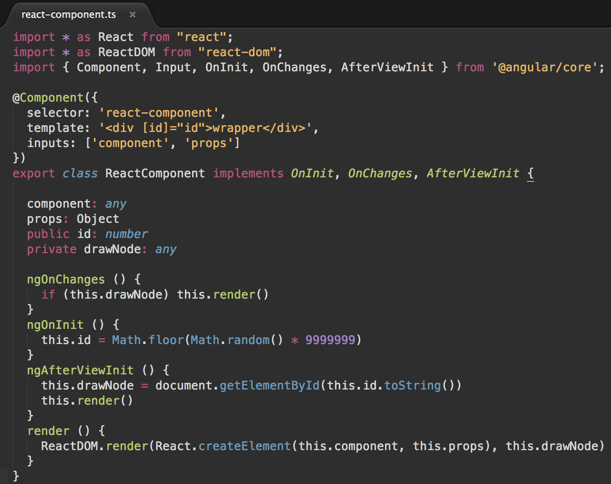

那么react-component怎么成功让这个tsx文件里这个react组件在angular运作呢

这里的使用到的生命钩子按照ngOnChanges => ngOnInit => ngAfterViewInit的顺序执行

因为有输入属性，所以ngOnchanges会在第一次组件获取及绑定输入属性时调用，

输入属性的值变动时，也会触发这个钩子 执行render()方法 重新更新

第一次调用ngOnchanges时，drawnode不存在，不执行

然后执行ngOninit钩子方法，在这里随机生成了一个id供这个组件使用

然后执行ngAfterViewInit方法，

这里确保这个组件和他的子组件都已经创建完成了，然后我们根据id来获取这个组件的dom元素，并且执行render方法

我们使用了React.createElement方法，用我们获得的component和props来创建一个React元素

并通过调用ReactDOM.render方法，把React元素渲染到提供的DOM容器中。

相关库：git clone git@github.com:Akiq2016/ng2react.git